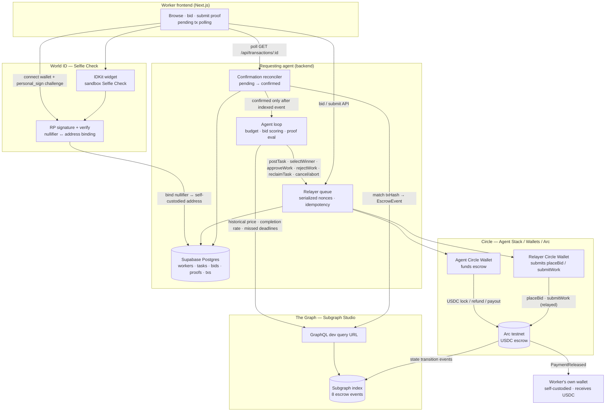
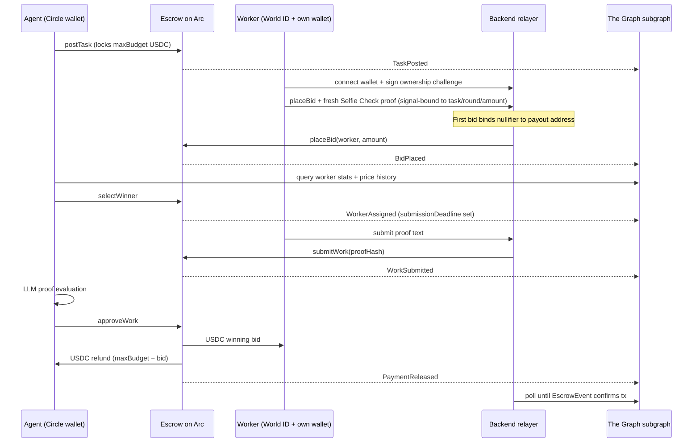

# Levantate Bridge — architecture

High-level system design with **sponsor-product labels** on each integration leg. See [`spec.md`](spec.md) for requirements and [`../AGENTS.md`](../AGENTS.md) for operational rules.

## System diagram

## Flow sequence (happy path)

## Reclaim path (missed submission deadline)

When an assigned worker passes `submissionDeadline` without submitting:

1. Agent calls **`reclaimTask`** manually via `POST /api/tasks/:id/reclaim` (not automatic in the agent loop).
2. Escrow stays locked at `maxBudget`; task returns to **Open** with `round` incremented.
3. Defaulting worker is **barred** from re-bidding that task.
4. Subgraph indexes **`TaskReclaimed`** → **`MissedDeadline`** reputation signal.

Round-2 winner selection and payout follow the same happy path with a new bidder.

## Sponsor mapping (what each product does here)

| Sponsor | Role in this repo |
| -------- | ----------------- |
| **Circle** | Developer-controlled **agent wallet** funds escrow; **relayer wallet** submits worker txs so workers never hold gas; `approveWork` settles USDC straight to the worker's **self-custodied** address. All settlement on **Arc testnet** native USDC (6-decimal ERC-20). |
| **World ID** | **Selfie Check** (`selfieCheckLegacy`, sandbox) gates **every bid**, not just signup. Backend signs **`rp_context`**, verifies each proof at `developer.world.org`, rejects a `signal` that doesn't match the task/round/amount being bid, and spends each proof once. Identity is read out of the proof, never supplied by the client. A one-time registration binds the **nullifier hash** to the worker's payout address to block duplicate identities. Framed as economic-participation eligibility, not identity proof. |
| **The Graph** | Subgraph on **`arc-testnet`** indexes all eight escrow events. Agent **queries live** for budget setting, bid scoring (price vs history, completion rate, missed deadlines). Subgraph is the **confirmation authority** — relayed txs stay `pending` until the matching event is indexed. |

## Repo layout

| Path | Purpose |
| ---- | ------- |
| `contracts/` | `TaskEscrow.sol`, Forge tests, Arc deploy script |
| `backend/` | Marketplace API, Circle + World ID + agent logic, relayer queue, confirmation tracker, Supabase schema |
| `frontend/` | Worker UI — tasks, Selfie Check, bid/submit, pending states |
| `subgraph/` | Schema, mappings, Studio deploy manifest |
| `docs/` | Spec, architecture (this file), Selfie Check feedback |

## Key API surfaces

| Endpoint | Actor | On-chain effect |
| -------- | ----- | --------------- |
| `POST /api/agent/chat` | Agent operator | Whichever escrow write the operator asks for, via LLM tool calling |
| `POST /api/agent/tasks` | Agent | `postTask` (+ USDC approve) |
| `POST /api/tasks/:id/bid` | Worker | `placeBid` via relayer |
| `POST /api/tasks/:id/select` | Agent | `selectWinner` |
| `POST /api/tasks/:id/submit` | Worker | `submitWork(proofHash)` via relayer |
| Agent cycle / `POST /api/agent/run-once` | Agent | `approveWork` or `rejectWork` after LLM eval |
| `POST /api/tasks/:id/reclaim` | Agent | `reclaimTask` |
| `POST /api/tasks/:id/cancel` | Agent | `cancelTask` or `abortTask` |
| `POST /api/wallet/challenge` | Worker | None — issues the off-chain ownership message to sign |
| `POST /api/wallet/link` | Worker | Consume the signature; store the payout address until the first bid binds it |
| `POST /api/tasks/:id/bids` | Worker | Fresh Selfie Check proof, signal-bound to task/round/amount |
| `GET /api/workers/:address/balance` | Worker | Read USDC balance on Arc |

Escrow writes return a **pending handle** (`GET /api/transactions/:id`); success is confirmed via subgraph events.

Every escrow write — HTTP route, autonomous loop, or chat agent — goes through
`backend/src/agent/operations.ts`, so the task-state guards exist in exactly one place.

**Key custody:** Circle holds key material for the **agent** and **relayer** wallets only. Workers hold their own keys, so a compromise of `CIRCLE_API_KEY` + `CIRCLE_ENTITY_SECRET` can disrupt the marketplace and drain the escrow float but cannot move worker earnings. There is no backend-initiated worker withdrawal path.

## Deployed testnet artifacts

Current escrow (v2, includes `abortTask` and duplicate-bid guard):

- **Contract:** `0xc8F1db364B14D7Aa4ea620bF9f649Ef3D7F14d52`
- **Deploy block:** `61231705`
- **Subgraph:** `https://api.studio.thegraph.com/query/1758979/levantate-bridge/v0.0.4`
- **Explorer:** [testnet.arcscan.app](https://testnet.arcscan.app)
