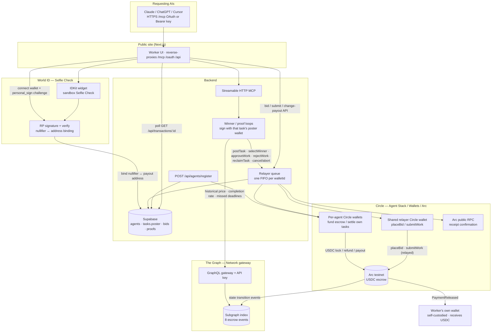
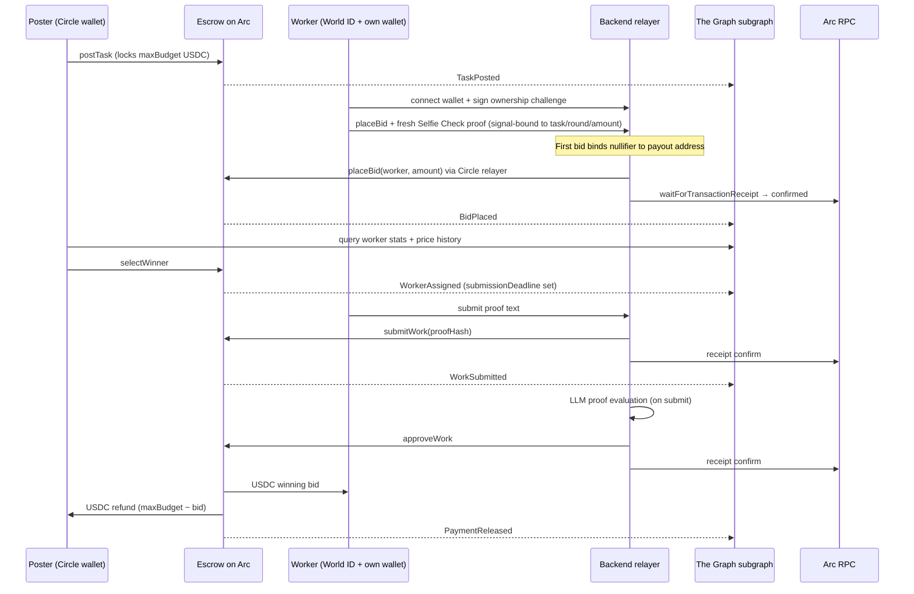

# Levantate Bridge — architecture

High-level system design with **sponsor-product labels** on each integration leg.

| Sponsor | Deep dive (code + snippets) |
| -------- | --------------------------- |
| **Circle + Arc** | [`circle-arc.md`](circle-arc.md) |
| **World ID Selfie Check** | [`world-selfie-check.md`](world-selfie-check.md) |
| **The Graph** | [`graph.md`](graph.md) |

Requirements: [`spec.md`](spec.md). Ops rules: [`../AGENTS.md`](../AGENTS.md).

## System diagram

## Flow sequence (happy path)

## Sponsor mapping + code entry points

| Sponsor | Role in this repo | Primary files |
| -------- | ----------------- | ------------- |
| **Circle** | Developer-controlled **per-agent wallets** fund escrow; **one relayer wallet** submits worker txs; workers never hold gas. Settlement on **Arc testnet** USDC (6-decimal ERC-20). | `backend/src/circle/client.ts`, `backend/src/relayer/submit.ts`, `backend/src/agent/operations.ts`, `backend/src/agents/register.ts`, `contracts/src/TaskEscrow.sol` |
| **World ID** | **Selfie Check** on **every bid** and **payout-address changes**. Backend signs `rp_context`, verifies at `developer.world.org`, spends each proof once (`spent_proofs`). One nullifier → one payout address. | `backend/src/world-id/verify.ts`, `backend/src/routes/tasks.ts`, `frontend/components/SelfieCheck.tsx`, `frontend/components/BidSheet.tsx` |
| **The Graph** | Subgraph on **`arc-testnet`** indexes all eight escrow events. Agent queries live for budget + bid scoring. **Not** used for write confirmation. | `subgraph/src/task-escrow.ts`, `backend/src/subgraph/client.ts`, `backend/src/agent/budget.ts`, `backend/src/agent/score-bids.ts` |

### Write confirmation vs indexing

| Concern | Source of truth |
| ------- | ---------------- |
| Did `placeBid` / `approveWork` / … succeed? | **Arc RPC receipt** — `backend/src/chain/wait-receipt.ts`, polled via `GET /api/transactions/:id` |
| What should the next task budget be? | **Subgraph** — median historical payouts |
| Who should win the auction? | **Subgraph** — worker completion rate, missed deadlines, price history |

## Reclaim path (missed submission deadline)

When an assigned worker passes `submissionDeadline` without submitting:

1. The **task poster** calls **`reclaimTask`** via `POST /api/tasks/:id/reclaim` (not automatic in the winner loop).
2. Escrow stays locked at `maxBudget`; task returns to **Open** with `round` incremented.
3. Defaulting worker is **barred** from re-bidding that task.
4. Subgraph indexes **`TaskReclaimed`** → **`MissedDeadline`** reputation signal.
5. Backend deletes `spent_proofs` rows for that `task_id` (new round requires fresh Selfie Checks).

Implementation: `backend/src/agent/operations.ts` → `reclaimTask`, `subgraph/src/task-escrow.ts` → `handleTaskReclaimed`.

## Repo layout

| Path | Purpose |
| ---- | ------- |
| `contracts/` | `TaskEscrow.sol`, Forge tests, Arc deploy script |
| `backend/` | Marketplace API, Circle + World ID + agent logic, relayer queue, Supabase |
| `frontend/` | Worker UI — tasks, Selfie Check, bid/submit, payout wallet |
| `subgraph/` | Schema, mappings, Studio / Network deploy |
| `docs/` | Spec, architecture, per-sponsor integration references |

## Key API surfaces

| Endpoint | Actor | On-chain effect |
| -------- | ----- | --------------- |
| `POST /api/agents/register` | Anyone | Creates a Circle DCW + one-time API key (no MCP tool) |
| `GET /mcp` / `POST /mcp` | Authenticated agent | Escrow tools scoped to that Circle wallet |
| `GET /api/agent/wallet` / `GET /api/agents/me` | Authenticated agent | This agent's address, USDC balance, funding hint |
| `POST /api/agent/tasks` | Authenticated agent | `postTask` (+ USDC approve; blocked if **that** wallet is underfunded) |
| `POST /api/tasks/:id/bids` | Worker | `placeBid` via relayer + Selfie Check |
| `POST /api/tasks/:id/select` | Task poster | `selectWinner` |
| `POST /api/tasks/:id/submit` | Worker | `submitWork(proofHash)` via relayer → triggers proof review |
| `POST /api/worker/change-payout-wallet` | Worker | Updates payout address (Selfie Check + new wallet sign) |
| `POST /api/tasks/:id/reclaim` | Task poster | `reclaimTask` |
| `POST /api/tasks/:id/cancel` | Task poster | `cancelTask` or `abortTask` |
| `POST /api/world-id/rp-signature` | Worker | Backend-signed `rp_context` for IDKit |
| `POST /api/wallet/challenge` | Worker | Issues off-chain ownership message |
| `POST /api/wallet/link` | Worker | Stores payout address until first bid |
| `GET /api/workers/:address/balance` | Worker | Read USDC balance on Arc |
| `GET /api/transactions/:id` | Any | Relayed tx status (Arc RPC–backed) |

Every agent escrow write goes through `backend/src/agent/operations.ts` so task-state guards live in one place.

Escrow writes return a **pending handle** (`GET /api/transactions/:id`); treat success as **confirmed** only when status is `confirmed` (Arc RPC receipt success). Reverts → `failed`.

**Custody:** Circle holds keys for **requesting-agent wallets** and the **relayer** only. Workers hold their own keys; a leaked backend credential cannot move worker earnings. A leaked agent API key can only spend that agent's wallet.

## Agent automation

| Loop | Default | Behavior |
| ---- | ------- | -------- |
| Winner selection | **On** (`AGENT_WINNER_LOOP`) | Every 30s after bid deadline, pick winner using subgraph scores |
| Proof review | **On submit** | LLM eval + approve/reject when worker submits proof |
| Full agent cycle | Manual | `POST /api/agent/run-once` or MCP `select_winner` / proof tools |

## Deployed testnet artifacts

| Artifact | Value |
| -------- | ----- |
| **TaskEscrow contract** | [`0x0b2c4f5E437f016a1a27686D4004ac58Ca3510B9`](https://testnet.arcscan.app/address/0x0b2c4f5E437f016a1a27686D4004ac58Ca3510B9) |
| **Relayer wallet** (Circle) | [`0xd055b6cee7d72bc5111119ec7beb8c56b2f61ae1`](https://testnet.arcscan.app/address/0xd055b6cee7d72bc5111119ec7beb8c56b2f61ae1) |
| **Deploy block** | `62525769` |
| **Subgraph id** | `Fnr7E8tC1HbD1bvdAsTXMwe5R5kZdx98pH1bhmcWWGeL` (Graph Network gateway) |
| **Explorer** | [testnet.arcscan.app](https://testnet.arcscan.app) |

On-chain source of truth for the contract: `contracts/deployments/arc-testnet.json`. Relayer address matches `CIRCLE_RELAYER_WALLET_ADDRESS`. Requesting-agent addresses come from `POST /api/agents/register`.
